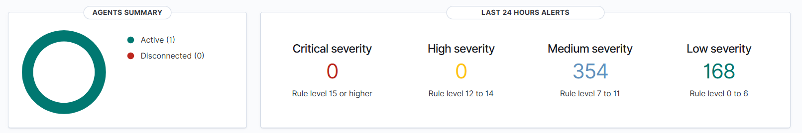
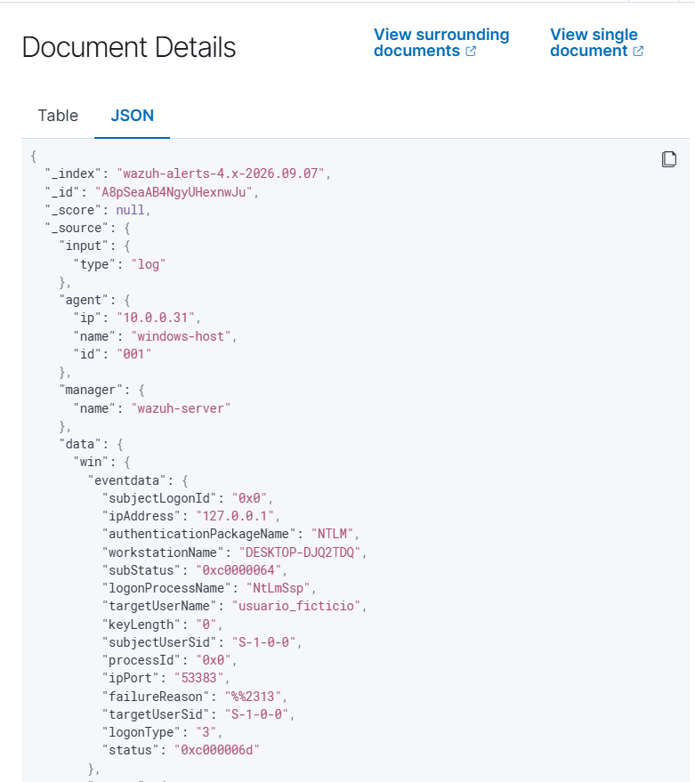

# Open-Source SIEM Deployment & Threat Detection Lab (Wazuh)

## Project Overview
This project demonstrates the deployment of an enterprise-grade open-source Security Information and Event Management (SIEM) system using **Wazuh** and **VirtualBox**. The main goal was to establish a centralized logging and monitoring environment to detect suspicious activities and authentication anomalies on host endpoints.

## Architecture & Components
* **SIEM Manager:** Wazuh Virtual Appliance (v4.14.7) hosted on Oracle VirtualBox.
* **Monitored Endpoint:** Windows 11 Host running the official Wazuh Agent.
* **Network Configuration:** Bridged/Internal Network for seamless endpoint-to-manager communications.

## Implementation Steps
1. **SIEM Infrastructure Setup:** Deployed and configured the Wazuh All-in-One OVA stack, verifying dashboard access and system services.
2. **Endpoint Enrollment:** Configured cross-platform agent connectivity and verified active telemetry streams via PowerShell enrollment scripts.
3. **Attack Simulation & Event Logging:** Simulated unauthorized authentication attempts (`Event ID 4625: Failed Logon`) using command-line interface scripts to validate rule execution and real-time alerting.

## Threat Detection Validation

Below is the active telemetry and detection evidence captured during the attack simulation:

*Figure 1: Centralized dashboard showing active agents and event severity breakdown.*

*Figure 2: Real-time detection of failed authentication attempts (Rule ID 60122).*

*Figure 3: Structured JSON payload details showing target user (`usuario_ficticio`) and local source IP.*

## Key Learnings & SOC Competencies
* **Log Analysis:** Interpreted structured JSON logs and mapped events to Windows Security Event IDs.
* **Agent Management:** Learned cross-platform agent deployment, enrollment strategies, and network troubleshooting.
* **Threat Detection:** Understood how SIEM rule levels trigger alerts based on threshold parameters for anomalous activities.
